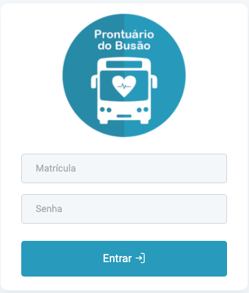
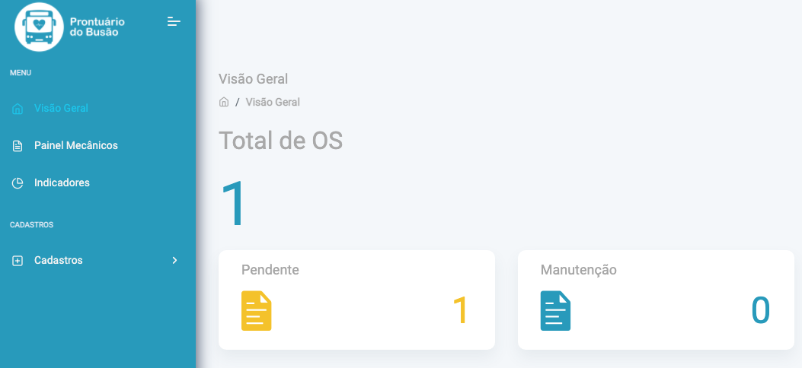
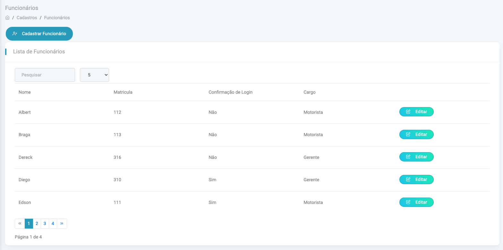

# Aplicação Web Prontuário do Busão
<h1 align="center">
  
</h1>

<p align="center">
  

  

  
</p>

## 💻 Sobre o projeto

A Prontuário do Busão é uma solução que se baseia na coleta de dados relacionados a manutenção da frota, e um dashboard de indicadores estratégicos e de previsibilidade.

Funcionalidades
- Dashboard
- Cadastro de veiculos e funcionários
- Relatórios por semana ou por datas
- Relatórios quantitativos e gerenciais:
  - Tempo médio para manutenção dos veículos
  - Problema X mecânico X Status X Categoria
  - Veiculos em manutenção
  - Problemas X quantidade

## 🎨 Layout

### Web

<p style="display: flex; align-items: flex-start; justify-content: center;">
  
</p>

<p align="center" style="display: flex; align-items: flex-start; justify-content: center;">
  
  
</p>

## 🛠 Tecnologias

As seguintes ferramentas foram usadas na construção do projeto:
- [Docker](https://www.docker.com)
- [Rails](https://rubyonrails.org)
- [Node.js](https://nodejs.org/en/)
- [React](https://pt-br.reactjs.org/)
- [TypeScript](https://www.typescriptlang.org/)


## 🎲 Como executar o projeto

Podemos considerar este projeto como sendo divido em duas partes:
1. Back End (pasta api_pdb) que possui: 
- interface de comunição (API);
- Documentação online das rotas disponíveis; 
2. Front End (pasta frontend)
- Interface de usuário

💡 O Front End precisa que o Back End esteja sendo executado para funcionar.

### Pré-requisitos

Antes de começar, você vai precisar ter instalado em sua máquina as seguintes ferramentas:
[Git](https://git-scm.com) e o [Docker](https://www.docker.com). 

 ### 🚀 Executar projeto em modo desenvolvimento utilizando o DOCKER
- Execute as permissões nos scripts
```ruby
$ chmod +x ./api_pdb/docker/dev-entrypoint
$ chmod +x ./api_pdb/docker/test-entrypoint
``` 
- Copie o arquivo .dev.sample e defina da variaveis de ambiente
```ruby
$ cp .env.sample .env.dev
```

- Excute o script up_dev na raiz do projeto
<br>
💡 Obs: Este script exclui as imagens do backend e frontend e logo depois faz a criação dos mesmas.
```ruby
$ sh up_dev.sh 
```
- Verifique se todos os serviços foram iniciados
```ruby
$ docker-compose logs -f -t 
```

- Execute as migrações do banco e a primeira carga de dados
```ruby
$ docker-compose exec api_pdb_dev rails db:create db:migrate db:seed
```

- Visite a documentação da API para testes dos end points
```
localhost:3003/api-docs/index.html
```

- Visite a aplicação
```
localhost:8080/login

- usuário para acesso
identidade: 313
Senha: abc123
```

## 📝 Licença

Este projeto esta sobe a licença GPL - 2.0.

Feito pela equipe Pontuário do Busão para o projeto move Teresina da Prefeitura de Teresina.

🚀 Equipe de desenvolvimento

#### Jorge Luis Lima - Arquiteto de Software  [Contato](linkedin.com/in/jorge-lima-1a45a197)
#### Thiago Aderaldo - Analista de sistemas  [Contato](https://www.linkedin.com/in/thiago-aderaldo-lessa-2b7b0646)
#### Sebastião Jr. - Analista de negócio  [Contato](https://www.linkedin.com/in/sebasti%C3%A3o-junior-52b2b58a)